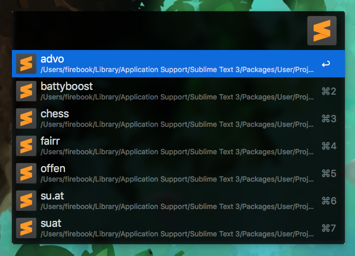
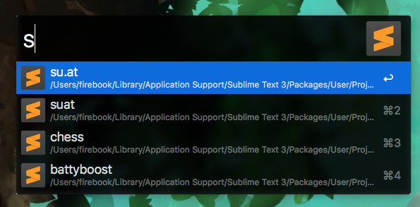
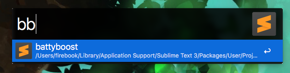

# Alfred Workflow - Sublime Text 3 Projects List

List and quickly open your Sublime Text 3 Projects. Set a Hotkey (like ⌃⇧S) and enter some characters of your project name
(the order of occurrence is important but you can skip characters, e.g.: "tst" matches "test" but "set" doesn't (wrong order)).

